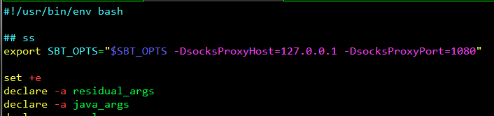
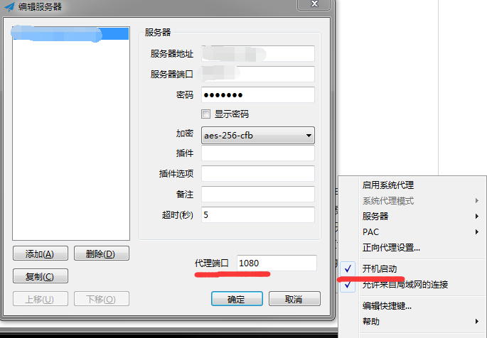
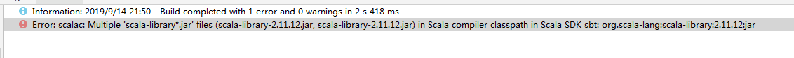

### 问题1 中国sbt问题

> 解决思路：让你的sbt能走shadowsocks代理。

#### windows
我这里windows中用的cygwin，理论上应该差不多。

主要是将sbt中的启动脚本中添加一串代理规则。

先找到sbt的启动程序，使用vim打开它，并在它的最上面加入如下内容：

DsocksProxyHost是你本地代理的ip，DsocksProxyPort是端口，具体写多少，看你的shadowsocks配置：

本地的代理默认是127.0.0.1，只需要注意代理端口，并且开启`允许来自局域网的连接`。

#### mac

---

### 问题2 multiple scala-library*.jar 多个scala包的问题

> 解决思路：错误提示已经很明确了，就是有多个scala的包，造成无法编译。

错误如下，在sbt项目中启动的时候，有可能会出现多个scala包的问题。

目前的做法是，在项目管理中直接所有scala相关的包删除掉。然后idea会自动提示你缺少包，你再重新引，这时候选择`只复制到项目中`即可。